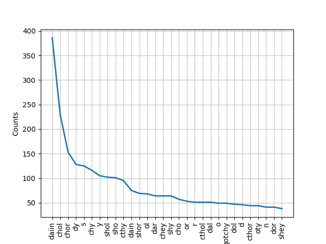
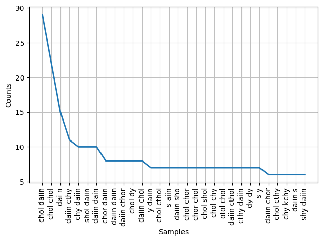

# voynich-investigation
## Investigations into this mysterious book

This is an investigation into a mysterious 600 year old book that has never been decoded. The book is written in an unknown language and has paintings of plants that don't exist. Science's best explanation is that a ufo accidentally dropped the book on the way to the next planet.

- [wikipleadia](https://en.wikipedia.org/wiki/Voynich_manuscript)
- [book download](https://archive.org/details/TheVoynichManuscript/page/n3/mode/2up)
- [text extractor](http://voynich.freie-literatur.de/index.php?show=extractor)

The following graph shows a word frequency chart showing how many times the top 30 most used words from the book are used. This suggests these words have similar meanings to common words in human languages as well. Note that word distributions like this also signify that this is indeed a language, and not random words.

This table displays the most common combination of two words. Possibly showing how these words are used in combination with each other.

Possible future comparative reference.

- [Human Book](https://nibmehub.com/opac-service/pdf/read/A%20handbook%20of%20Native%20American%20Herbs.pdf)

With further research, we may one day be able to speak with the space people, in their native language.